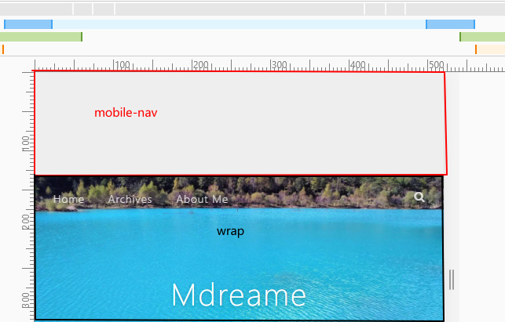
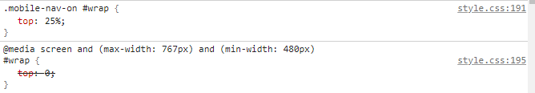
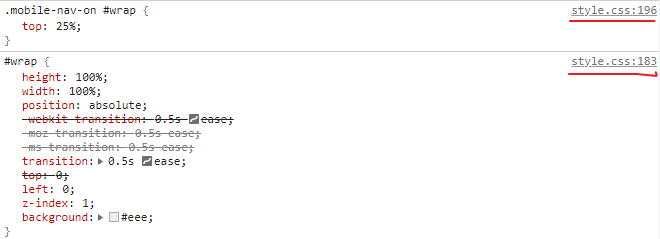
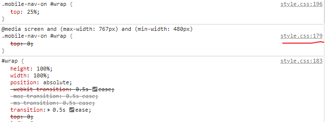
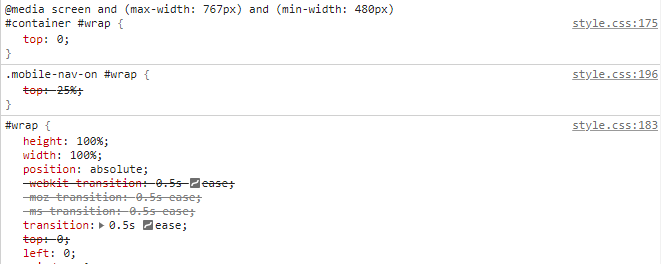

记媒体查询和CSS选择器的优先级。
<!--More-->

媒体查询在父级元素下的优先级大于元素本身。

container容器下有一个wrap和mobile-nav，预期效果是当点击按钮时，container添加.mobile-nav-on样式，wrap和mobile-nav做出相应变化。
接着遇到一个自适应的问题：希望当窗口变化到超出移动设备宽度时，自动隐藏mobile-nav并将wrap的高度设置为零，代码如下：
```
#container
  position: relative

.mobile-nav-on
  overflow: hidden

#wrap
  height: 100%
  width: 100%
  position: absolute
  transition: 0.5s ease
  top: 0
  background: color-background
  .mobile-nav-on &
    top: 25%
  @media mq-tablet
    top: 0

# mobile-nav
```
接着就遇到了问题：当宽度达到要求时，并没有出现预期效果。

在Chrome查看CSS样式发现：

修改代码，在.mobile-nav-on样式中增加媒体查询：
```
#container
  position: relative

.mobile-nav-on
  overflow: hidden
  @media mq-tablet
    #wrap
      top: 0

#wrap
  height: 100%
  width: 100%
  position: absolute
  transition: 0.5s ease
  top: 0
  left: 0
  .mobile-nav-on &
    top: 25%  
```
依然没效果，css为：

再将样式更改一下：
```
.mobile-nav-on
  overflow: hidden
  wrap
    @media mq-tablet
      top: 0
```
没效果，此时css为：

最后在container上添加查询：
```
#container
  position: relative
  @media mq-tablet
    #wrap
      top: 0

.mobile-nav-on
  overflow: hidden

#wrap
  height: 100%
  width: 100%
  position: absolute
  transition: 0.5s ease
  top: 0
  left: 0
  .mobile-nav-on &
    top: 25%  
```
可以实现，css为：

再将container样式改为：
```
#container
  position: relative
  #wrap
    @media mq-tablet
      top: 0
```
此时也可以实现效果，css样式为：


